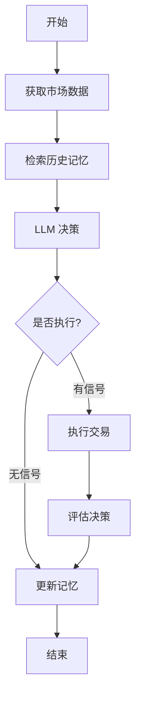

# NOFN 自主交易系统

## 🎯 基于 LangGraph 的透明交易系统

使用 LangGraph 构建的自主交易系统：

- ✅ **更透明**: 每个节点都是纯函数，工作流程一目了然
- ✅ **易于学习**: 使用标准的 LangChain 生态，不需要理解深层封装
- ✅ **高度灵活**: 可以轻松添加/删除节点，自定义工作流
- ✅ **易于调试**: 可以在任何节点查看状态，支持可视化
- ✅ **代码更少**: 300 行 vs 900 行，更易维护

## 📁 项目结构

```
nofn/
├── src/
│   ├── learning/             # 学习系统 (LangGraph)
│   │   ├── state.py          # 状态定义 (TypedDict)
│   │   ├── memory.py         # 记忆系统 (SQLAlchemy)
│   │   ├── agents.py         # Agent (LangChain)
│   │   └── graph.py          # 工作流图 (LangGraph)
│   │
│   ├── engine/               # 交易引擎 (共用)
│   ├── adapters/             # 交易所适配器 (共用)
│   └── models/               # 数据模型 (共用)
│
├── main.py                   # 主程序启动文件
├── backup_agno/              # Agno 版本备份
├── MIGRATION_GUIDE.md        # 从 Agno 迁移指南
└── LANGGRAPH_ADVANTAGES.md   # LangGraph 优势说明
```

## 🚀 快速开始

### 1. 安装依赖

```bash
# 安装 LangGraph 相关依赖
pip install -r requirements_langgraph.txt
```

### 2. 配置环境变量

创建 `.env` 文件：

```bash
# Hyperliquid 配置
HYPERLIQUID_ADDRESS=your_wallet_address
HYPERLIQUID_SECRET=your_private_key

# OpenAI 配置
OPENAI_API_KEY=your_api_key
OPENAI_BASE_URL=https://api.openai.com/v1  # 可选
```

### 3. 运行

```bash
python main.py
```

## 🔄 工作流程图



## 📚 核心组件

### 1. TradingState (状态管理)

```python
from src.learning.state import TradingState
from typing import Annotated
from operator import add

class TradingState(TypedDict, total=False):
    """工作流状态"""
    symbols: List[str]
    market_snapshot: MarketSnapshot
    decision: Dict[str, Any]
    execution_results: List[Dict]

    # 自动累积经验
    lessons_learned: Annotated[List[str], add]
```

### 2. TradingMemory (记忆系统)

```python
from src.learning.memory import TradingMemory

# 使用 SQLAlchemy ORM，易于理解和扩展
memory = TradingMemory(db_path="data/trading_memory.db")

# 添加案例
memory.add_case(case)

# 获取上下文
context = memory.get_context(market_conditions, recent_days=7)
```

### 3. TradingAgent (LLM Agent)

```python
from src.learning.agents import TradingAgent

# 直接使用 LangChain，没有额外封装
agent = TradingAgent(
    model_provider="openai",
    model_id="gpt-4o-mini",
    api_key=api_key,
)

# 决策
decision = await agent.make_decision(market_snapshot, memory_context)

# 评估
evaluation = await agent.evaluate_and_learn(decision, results, account_info, snapshot)
```

### 4. TradingWorkflowGraph (工作流)

```python
from src.learning.graph import TradingWorkflowGraph

# 创建工作流
workflow = TradingWorkflowGraph(engine, agent, memory)

# 运行一次迭代
final_state = await workflow.run_iteration(symbols, iteration)
```

## 🔧 自定义工作流

### 添加新节点非常简单

```python
# 在 graph.py 中添加新节点
async def risk_check(self, state: TradingState) -> TradingState:
    """风险检查节点"""
    account = await self._get_account_info()

    if account['balance']['available'] < 100:
        state['warnings'].append("余额不足")
        state['should_execute'] = False

    return state

# 在 _build_graph 中插入节点
def _build_graph(self):
    workflow = StateGraph(TradingState)

    # 添加节点
    workflow.add_node("risk_check", self.risk_check)

    # 插入到工作流中
    workflow.add_edge("retrieve_memory", "risk_check")
    workflow.add_edge("risk_check", "make_decision")
```

## 📊 架构特点

| 特性 | 实现方式 |
|------|----------|
| 工作流 | ✅ LangGraph StateGraph |
| LLM 调用 | ✅ LangChain (透明可控) |
| 数据库 | ✅ SQLAlchemy ORM |
| 可视化 | ✅ Mermaid/PNG |
| 调试 | ✅ 节点级调试 |
| 扩展性 | ✅ 添加节点即可 |
| 代码量 | ~300 行 (核心) |

详细说明见 [LANGGRAPH_ADVANTAGES.md](./LANGGRAPH_ADVANTAGES.md)

## 📖 文档

- [MIGRATION_GUIDE.md](./MIGRATION_GUIDE.md) - 从 Agno 迁移的详细指南
- [LANGGRAPH_ADVANTAGES.md](./LANGGRAPH_ADVANTAGES.md) - LangGraph 优势深度对比
- [LangGraph 官方文档](https://python.langchain.com/docs/langgraph)

## 🎓 学习路径

1. **理解状态管理**: 阅读 `src/learning/state.py`
2. **理解节点**: 阅读 `src/learning/graph.py` 中的节点函数
3. **理解边**: 查看 `_build_graph()` 中的边定义
4. **自定义工作流**: 尝试添加新节点
5. **可视化**: 导出 Mermaid 图查看工作流

## 💡 最佳实践

### 1. 每个节点应该是纯函数

```python
async def node_function(self, state: TradingState) -> TradingState:
    """
    接收 state，处理后返回更新的 state
    不应该有副作用（除了必要的 I/O）
    """
    # 读取状态
    data = state['some_data']

    # 处理逻辑
    result = await self.process(data)

    # 更新状态
    state['result'] = result

    return state
```

### 2. 使用 Annotated 累积状态

```python
from typing import Annotated
from operator import add

class TradingState(TypedDict):
    # 自动累积列表
    lessons_learned: Annotated[List[str], add]
```

### 3. 使用条件边实现灵活路由

```python
workflow.add_conditional_edges(
    "decision_node",
    lambda s: "execute" if s['should_execute'] else "skip",
    {
        "execute": "execute_node",
        "skip": "skip_node",
    }
)
```

## 🐛 调试技巧

### 1. 打印每个节点的状态

```python
async def my_node(self, state: TradingState) -> TradingState:
    print(f"节点开始 - 输入状态: {state.keys()}")

    # 处理...

    print(f"节点结束 - 输出状态: {state.keys()}")
    return state
```

### 2. 添加调试节点

```python
def debug_node(state: TradingState) -> TradingState:
    import pprint
    pprint.pprint(state)
    return state

workflow.add_node("debug", debug_node)
workflow.add_edge("make_decision", "debug")
workflow.add_edge("debug", "execute_trades")
```

### 3. 导出并查看图结构

```python
mermaid_code = workflow.graph.get_graph().draw_mermaid()
print(mermaid_code)
```

## 🚧 开发计划

- [ ] 添加 Analyst Agent (深度分析节点)
- [ ] 完善人工介入节点
- [ ] 完善 WebSocket 实时数据节点
- [ ] 添加风险管理节点
- [ ] 支持多策略并行运行
- [ ] 添加回测功能

## 📝 许可证

MIT

## 🙏 致谢

- [LangGraph](https://python.langchain.com/docs/langgraph) - 工作流框架
- [LangChain](https://python.langchain.com/) - LLM 工具链
- [Hyperliquid](https://hyperliquid.xyz/) - 去中心化交易所